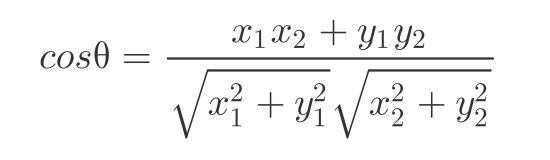
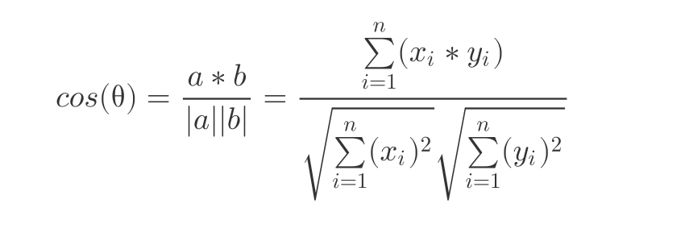
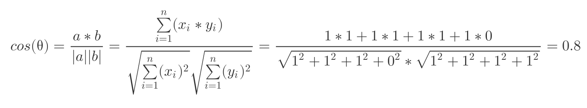
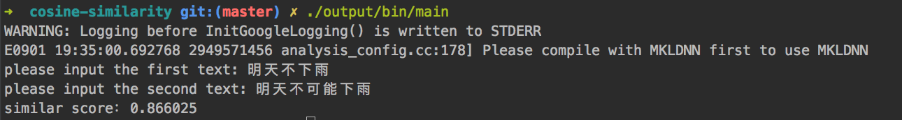

# cosine-similarity
基于余弦相似度算法计算文本相似度

## 原理
在数学几何运算中，余弦定理用于计算两条边的夹角，余弦值越大，夹角越小。当夹角为0°时，两条边(x,y)完全重合。计算公式如下：


而对于多维图像(x,y,z...)三(甚至n)条边，计算公式如下：


同样对于计算两段文本，计算两段文本的相似度。将文本切割成若干个词向量，切词则交由NLP进行。而将每一个词向量看成数学几何运行中的边，最后则演变成计算多维余弦夹角。

* 文本切词
    * 文本1：明天\不\下雨
    * 文本2：明天\不\可能\下雨

* 文本词频统计
    * 文本1词频：(明天=>1, 不=>1, 下雨=>1, 可能=>0)
    * 文本2词频：(明天=>1, 不=>1, 下雨=>1, 可能=>1)

* 文本词向量
    * 文本1词向量：(1,1,1,0)
    * 文本2词向量：(1,1,1,1)

* 余弦计算
    

## 配置LAC切词
[百度NLP：分词，词性标注，命名实体识别](https://github.com/baidu/lac)

* CMakeLists.txt: 修改line:6中"paddle path"
* main.cpp: 修改line:9中"you model path"

## 编译运行
```
git clone https://github.com/icharle/cosine-similarity.git

cd cosine-similarity

cmake .

make && make install

# 运行(output/bin目录下即为二进制运行文件)
./output/bin/main
```

## 运行效果
